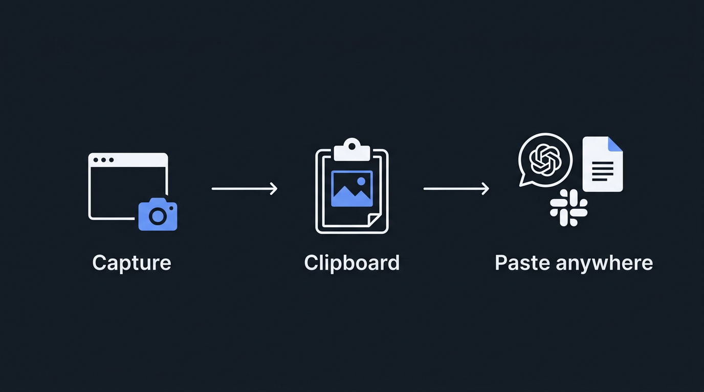
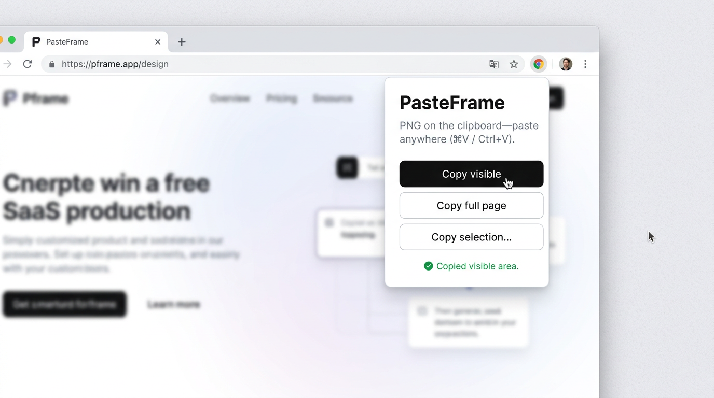
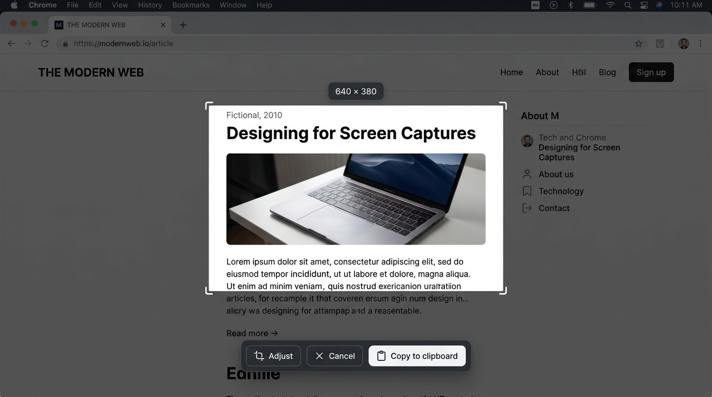

<div align="center">

# PasteFrame

**Screenshot it. Copy it. Paste it. Done.**

A Chrome extension that puts screenshots on your clipboard as PNG — no files, no clutter, just **⌘V / Ctrl+V** wherever you need it.

[](LICENSE)
[](https://developer.chrome.com/docs/extensions/mv3/)
[](https://github.com/Parvez2017/pasteframe/pulls)

<br />



<br />

</div>

---

## The Problem

Most screenshot extensions force you to **download an image** or **save a PDF** just to share what's on your screen. Your Downloads folder fills up with `Screenshot 2026-03-25 at...png` files you'll never organize.

**PasteFrame** skips the file entirely — the screenshot goes straight to your clipboard. Paste it into ChatGPT, Claude, Slack, Notion, Google Docs, or anywhere that accepts images.

---

## Screenshots

<table>
<tr>
<td width="50%" align="center">

**Popup — one-click capture**



</td>
<td width="50%" align="center">

**Region picker — crop and copy**



</td>
</tr>
</table>

---

## Features

| Mode | What it does |
|------|-------------|
| **Copy visible** | Captures the current viewport and copies it |
| **Copy full page** | Scrolls the entire page, stitches the slices into one tall image, copies it |
| **Copy selection** | Shows a full-screen overlay — drag to select a region, then confirm with the bottom bar |

**Shortcuts inside region picker:**
- **Esc** — cancel
- **Enter** — copy (when toolbar is visible)
- **Adjust** button — redraw the selection

---

## Install

### From source (recommended for now)

```bash
git clone https://github.com/Parvez2017/pasteframe.git
cd pasteframe
```

1. Open `chrome://extensions`
2. Turn on **Developer mode** (top-right toggle)
3. Click **Load unpacked**
4. Select the `pasteframe` folder (the one with `manifest.json`)
5. Pin PasteFrame from the extensions menu

### Chrome Web Store

Coming soon.

---

## How It Works

```
┌─────────────┐      ┌──────────────┐      ┌──────────────────┐
│  You click   │ ───▸ │  Chrome API   │ ───▸ │   PNG blob on    │
│  a button    │      │  captures tab │      │   your clipboard │
└─────────────┘      └──────────────┘      └──────────────────┘
                                                     │
                                              ⌘V / Ctrl+V
                                                     ▼
                                           ChatGPT, Slack, Docs,
                                           Figma, email… anywhere
```

**Visible / Full page** — the popup has a live user gesture, so `navigator.clipboard.write()` works directly.

**Region selection** — the popup closes when you interact with the page, so:
1. The service worker captures and crops with `OffscreenCanvas`
2. It focuses the tab via `chrome.windows.update` + `chrome.tabs.update`
3. A tiny injected script calls `clipboard.write()` while the page is focused
4. If that fails, an offscreen document handles it as a fallback

---

## Permissions

| Permission | Why |
|---|---|
| `activeTab` | Capture only the tab you're viewing — nothing in the background |
| `scripting` | Inject the region picker overlay and capture helpers |
| `clipboardWrite` | Put the PNG on the system clipboard |
| `offscreen` | Fallback clipboard write path when the page can't do it |
| `windows` | Focus the correct browser window so clipboard writes succeed |

**PasteFrame never sends your screenshots anywhere.** Everything stays in the browser.

---

## Project Structure

```
pasteframe/
├── manifest.json              # MV3 manifest
├── popup.html / popup.js      # Extension popup UI
├── popup.css                  # Popup styles
├── background.js              # Service worker — capture, crop, clipboard
├── offscreen.html / .js       # Offscreen document (clipboard fallback)
├── content/
│   └── region-picker.js       # Injected crop overlay
├── util.js                    # Shared blob/image helpers
├── assets/                    # README images
└── LICENSE                    # MIT
```

---

## Contributing

Issues and PRs are welcome. For anything beyond a small fix, consider opening an issue first so we can discuss direction.

```bash
# Dev smoke test (requires Chrome installed)
npm install
npm run test:browser
```

---

## License

MIT — see [LICENSE](LICENSE).

Built with ❤️ by [Parvej](https://parvej.dev/).
